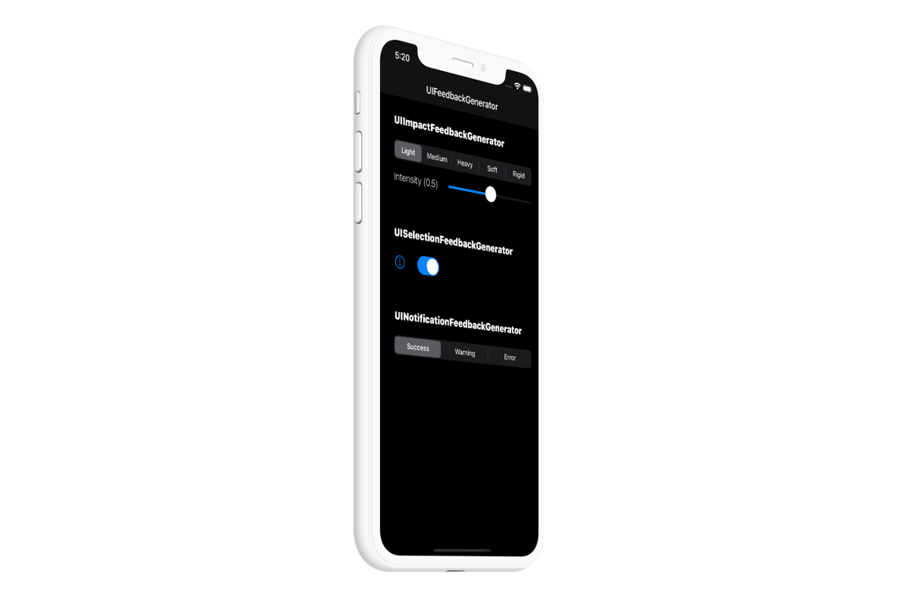

# iOS Haptics   

Haptics engage people's sense of touch to enhance the experience of interacting with onscreen interfaces. You can read more [here](https://developer.apple.com/design/human-interface-guidelines/ios/user-interaction/haptics/) 

### Notification

-   [Success](https://developer.apple.com/design/human-interface-guidelines/ios/user-interaction/haptics/#)
-   [Warning](https://developer.apple.com/design/human-interface-guidelines/ios/user-interaction/haptics/#)
-   [Failure](https://developer.apple.com/design/human-interface-guidelines/ios/user-interaction/haptics/#)

### Impact

-   [Light](https://developer.apple.com/design/human-interface-guidelines/ios/user-interaction/haptics/#)
-   [Medium](https://developer.apple.com/design/human-interface-guidelines/ios/user-interaction/haptics/#)
-   [Heavy](https://developer.apple.com/design/human-interface-guidelines/ios/user-interaction/haptics/#)
-   [Rigid](https://developer.apple.com/design/human-interface-guidelines/ios/user-interaction/haptics/#)
-   [Soft](https://developer.apple.com/design/human-interface-guidelines/ios/user-interaction/haptics/#)

### Selection

-   [Selection](https://developer.apple.com/design/human-interface-guidelines/ios/user-interaction/haptics/#)

---

I'm [Rui Aureliano](http://ruiaureliano.com), iOS and macOS Engineer at [Olá Brothers](https://theolabrothers.com). We make [Sip](https://sipapp.io) 🤓

[Linkedin](https://www.linkedin.com/in/ruiaureliano) | [AngelList](https://angel.co/ruiaureliano) | [Twitter](https://twitter.com/ruiaureliano) | [Github](https://github.com/ruiaureliano) | [Medium](https://medium.com/@ruiaureliano) | [Stackoverflow](https://stackoverflow.com/users/881095/ruiaureliano)
