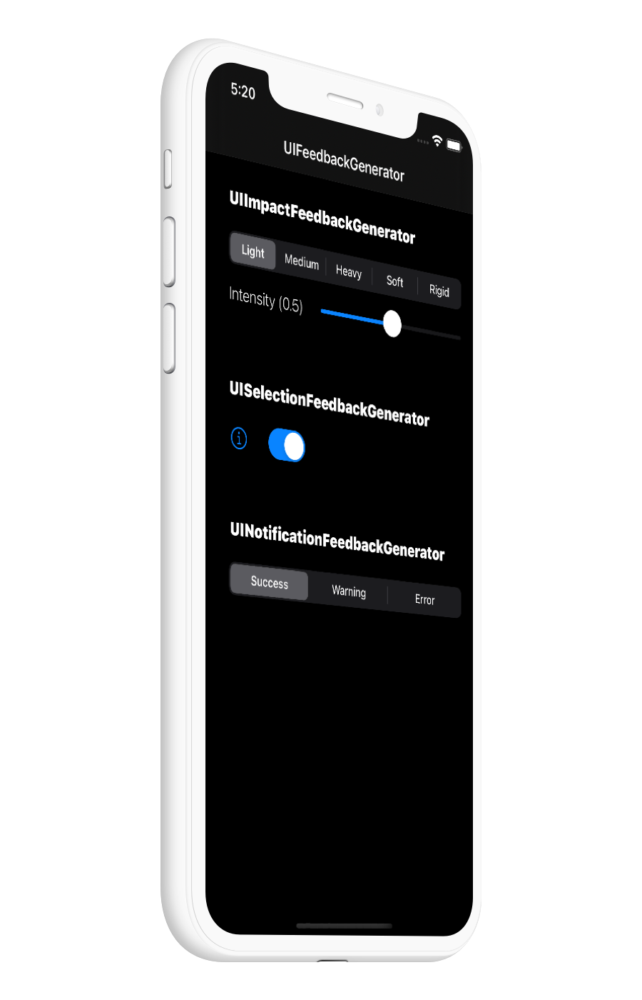

# Haptics Demo for iPhone []

Haptics engage people's sense of touch to enhance the experience of interacting with onscreen interfaces. You can read more [here](https://developer.apple.com/design/human-interface-guidelines/ios/user-interaction/haptics/) 

## Notification

-   [Success](https://developer.apple.com/design/human-interface-guidelines/ios/user-interaction/haptics/#)
-   [Warning](https://developer.apple.com/design/human-interface-guidelines/ios/user-interaction/haptics/#)
-   [Failure](https://developer.apple.com/design/human-interface-guidelines/ios/user-interaction/haptics/#)

## Impact

-   [Light](https://developer.apple.com/design/human-interface-guidelines/ios/user-interaction/haptics/#)
-   [Medium](https://developer.apple.com/design/human-interface-guidelines/ios/user-interaction/haptics/#)
-   [Heavy](https://developer.apple.com/design/human-interface-guidelines/ios/user-interaction/haptics/#)
-   [Rigid](https://developer.apple.com/design/human-interface-guidelines/ios/user-interaction/haptics/#)
-   [Soft](https://developer.apple.com/design/human-interface-guidelines/ios/user-interaction/haptics/#)

## Selection

-   [Selection](https://developer.apple.com/design/human-interface-guidelines/ios/user-interaction/haptics/#)

---

###  Switcher preview in dark mode with some custom tint colors

